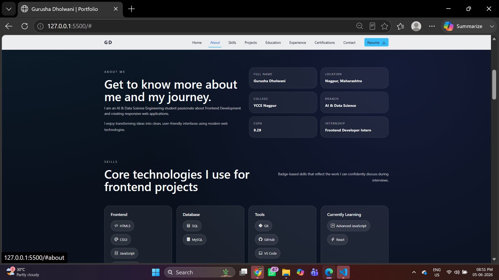
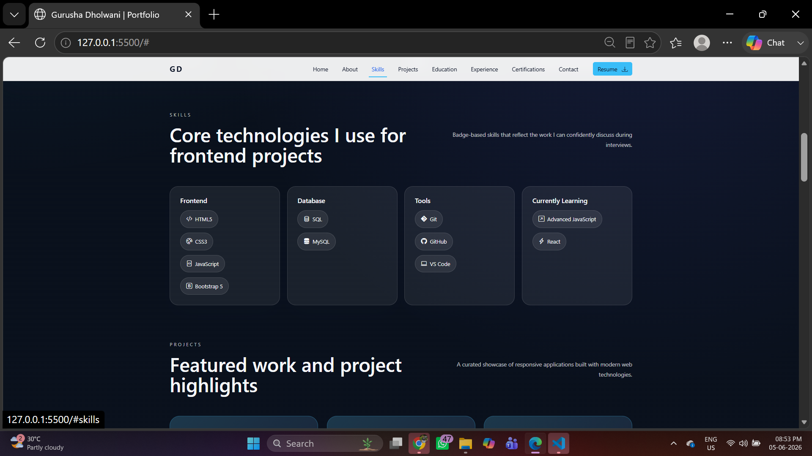
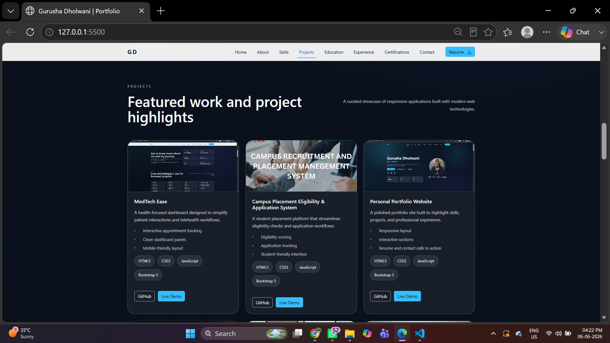
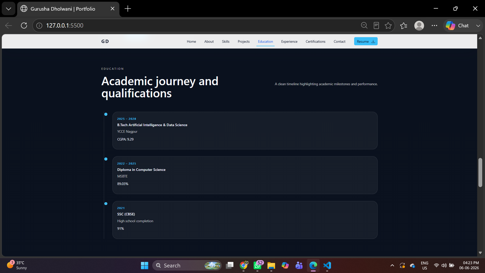
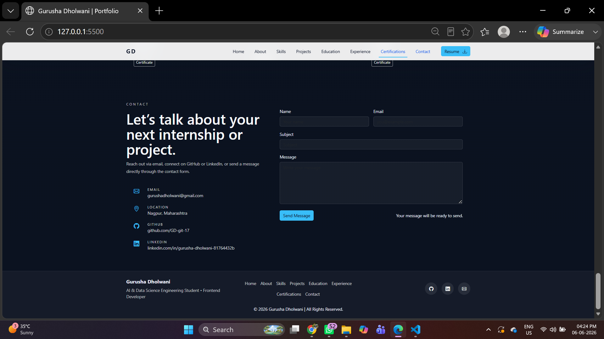

# Personal Portfolio Website

## Intern Information
* Name: Gurusha Dholwani
* Intern ID: CITS2414
* Domain: Frontend Web Development
* Duration: 4 Weeks

## Project Name
Personal Portfolio Website

## Project Overview
A modern, responsive, and professional personal portfolio website developed to showcase my education, skills, projects, certifications, and contact information.

The website is built using HTML5, CSS3, Bootstrap 5, and JavaScript, with a focus on responsive design, user experience, and clean UI principles.

## Project Scope
The objective of this project is to establish a professional online presence where recruiters, mentors, and potential employers can learn about my technical skills, academic achievements, and project experience.

## Project Objectives
* Build a professional online portfolio
* Demonstrate frontend development skills
* Showcase projects and achievements
* Practice responsive web design
* Improve Git and GitHub workflow

## Features
* Responsive Design
* Sticky Navigation Bar
* Hero Section
* About Me Section
* Skills Showcase
* Education Timeline
* Internship Experience
* Projects Showcase
* Certifications Section
* Contact Form
* Social Media Integration
* Download Resume Button
* Smooth Scrolling Navigation

## Technologies Used
* HTML5
* CSS3
* Bootstrap 5
* JavaScript
* Git
* GitHub

## Folder Structure
Personal-Portfolio-Website/
├── index.html
├── css/
│   └── style.css
├── js/
│   └── script.js
├── assets/
│   ├── profile.jpeg
│   └── RESUME.pdf
├── documentation/
├── screenshots
└── README.md

## Screenshots
The gallery below uses the screenshot images included in the `assets/` folder

* 
* 
* 
* 
* 
* 

## Output
The website successfully presents:
* Personal Information
* Academic Background
* Technical Skills
* Internship Experience
* Projects Portfolio
* Certifications
* Contact Information
in a fully responsive and user-friendly layout.

## Learning Outcomes
* Responsive Web Design
* Bootstrap Grid System
* Frontend Development Best Practices
* Git & GitHub Workflow
* Project Documentation
* UI/UX Design Principles

## Future Enhancements
* Dark Mode Toggle
* Blog Section
* Project Filtering
* Backend Contact Form Integration
* Advanced Animations
* Project Search Functionality

## How to Run

1. Clone the repository:

```bash
git clone https://github.com/GD-git-17/Personal-Portfolio-Website.git
```

2. Open the project folder.

3. Open `index.html` in any modern web browser.

## GitHub Repository

[https://github.com/GD-git-17/Personal-Portfolio-Website](https://github.com/GD-git-17/Personal-Portfolio-Website)


## Author
### Gurusha Dholwani
AI & Data Science Engineering Student
Frontend Web Development Intern

GitHub:
[https://github.com/GD-git-17](https://github.com/GD-git-17)

LinkedIn:
[https://www.linkedin.com/in/gurusha-dholwani-81764432b](https://www.linkedin.com/in/gurusha-dholwani-81764432b)

Email:
[gurushadholwani@gmail.com](mailto:gurushadholwani@gmail.com)


## License
This project is created for educational and portfolio purposes.
